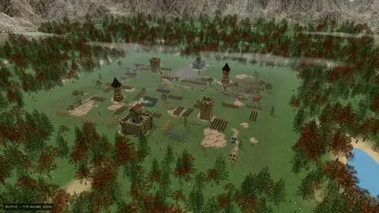
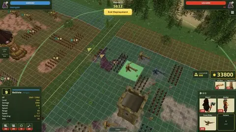
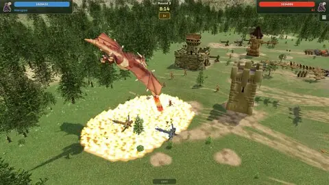
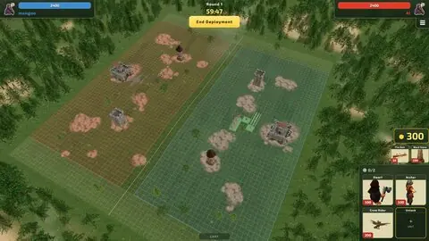

# MELODAN

**FANTASY AUTO·BATTLER**

Deploy armies in secret and watch the round play out. Your enemy does the same.
Adapt, repeat until one of you runs out of HP.

**Website:** [melodan.com](https://melodan.com)  
**Play now:** [play.melodan.com](https://play.melodan.com) (free in the browser · single & multiplayer)  
**Steam:** [steam.melodan.com](https://steam.melodan.com) (ranked multiplayer · play with your friends)

Built with [three.js](https://threejs.org) for the battlefield, [PixiJS](https://pixijs.com)
for the UI overlay, and [steam-electron-build](https://github.com/alexanderthurn/steam-electron-build)
for the desktop / Steam client.

## Screenshots

<p align="center">
  <a href="assets/marketing/screenshots/4k/sc1.jpg"></a>
  <a href="assets/marketing/screenshots/4k/sc2.jpg"></a>
  <a href="assets/marketing/screenshots/4k/sc3.jpg"></a>
  <a href="assets/marketing/screenshots/4k/sc4.jpg"></a>
</p>

## How it plays

- **Specialists** — before round one, each player picks a specialist. It sets your starting army, HP pool, and a permanent speciality for the rest of the match.
- **Deployment** — buy packs, level them with banked XP, buy techs and building upgrades, equip items, place wards and fire bolts; position everything on your side of the grid (flanks unlock after round 1), hidden from the enemy until the fight starts.
- **Round cards** — from round two onward there is a chance to draft from a random offer. Cards grant packs, items, or tactic charges.
- **Battle** — fully automatic: units march, fight, and cast. Survivors damage the enemy commander by their remaining value; losing a command tower debuffs your army for a while. First to 0 HP loses.
- **Tactics & spells** — rallies, spills, summons, and battle spells like the dragon’s fire breath. Some arrive as round cards; others come from buildings or specialities.

**Multiplayer:** peer-to-peer (PeerJS) with quick match, a public lobby, and named rooms — deterministic lockstep with automatic desync recovery. Reloading mid-match reconnects and resumes.

Match rules (map, timers, economy, tower debuffs) live in one JSON-serializable settings object — see `src/game/settings.ts`. Architecture notes: [ARCHITECTURE.md](ARCHITECTURE.md).

## Match settings

Default values from `src/game/settings.ts` (`DEFAULT_SETTINGS` / `DEFAULT_HORDE`) — the same numbers rendered live on [melodan.com/#settings](https://melodan.com/#settings). Everything here is tunable in code.

**Timers & HP** — Deployment 90s · Battle 90s · Specialist pick 15s · Round card pick 15s · Starting HP 2000.

**Economy** — 200 supply round-1 income, +200/round growth (round N grants `startingSupply + (N-1) × growth`); tech cost escalation +200 per tech already owned of that unit type.

**Round cards** — off by default; from round 2 onward when on, or an explicit round list like `[3, 6, 9]`.

**Horde mode** — default level Medium (waves on round 5 and the final round 10; `low` = final round only, `high` = also rounds 3 & 7, `ultra` = every round, `off` = disabled). Round 1 wave value 300 supply, +200/active round, ×4 on the final round (which always fires, boosted, regardless of level). 65% of a wave is biased toward whoever is currently ahead on HP.

**Towers** — losing one of your own towers applies ×0.1 speed, ×0.1 attack, ×2.0 damage taken to that side (stacks multiplicatively) for 10s at tower level 1, −2s per level above that (a new loss adds its duration on top). Upgrading costs 100 supply +50/level, up to level 5.

**Deploy** — 2 buys per round. Command Tower one-shots (this round only): +1 buy for 50 supply, +5 ranged range for 100 supply, +3 army speed for 50 supply, Credit (+200 now, −300 next round). Shields/rockets share a 500-supply budget per round. First flank deploys stay armed 5s once flanks open.

**Leveling** — +100% hp/damage per level, up to level 9 (a purchase, never automatic) at 50% of the pack's base cost per level. A once-per-round 100-supply switch makes new recruits arrive at level 2.

**Sell** — one-time 100-supply Research Center purchase; once owned, sell up to 1 deployed pack per round for a 100% base-cost refund.

**Rally Route** — one-time 100-supply Research Center purchase granting one rally-route tactic charge (route new deploys to a rally point automatically).

**Boosts** — Research Center army-wide stat tiers, one bought after the other: Tier 1 100 supply → +10% damage/+15% hp; Tier 2 300 supply → +20% damage/+30% hp (totals, not stacked on top of the previous tier).

## Units & buildings

Your army and buildings: dwarves, archers, crow riders, ballistae, ward stones, fire bolts, command tower, research center, stronghold — each with stats, techs, and building abilities. Browse them on [melodan.com](https://melodan.com).

## Controls

| Input | Action |
| --- | --- |
| Left click | buy / select / place |
| Right click · drag | deselect · pan |
| Middle click · drag | rotate pack · orbit camera |
| Wheel | zoom to cursor |
| WASD / edges | pan · Q/E rotate · Home reset |

## Development

```bash
npm install
npm run dev          # browser with hot reload (game: /  ·  homepage: /web.html)
npm start            # Electron + Steam
npm run build        # game + homepage into dist/
npm run build:mac    # depot-ready build (mac | win | linux)
```

Dev URL params: `?hp=100&build=20` overrides starting HP / build timer.  
Localhost matchmaking defaults to [play.melodan.com](https://play.melodan.com); use `?branch=<name>` for a branch preview backend.

## About

MELODAN is made by **Alexander Thurn** at [Feuerware](https://feuerware.com/).

Inspired by [Mechabellum](https://www.playmechabellum.com/) — thank you for the spark. MELODAN is an independent fantasy take; please support the original.

## Contribute

Let’s make this together. The browser game is **free**; the source is **GPL-3.0**. Steam is for optional paid / platform features, not a lock on the core game.

- **Suggest** ideas, bugs, or how to help from [melodan.com](https://melodan.com/#suggest) or the in-game Suggest button (saved server-side; admin inbox at `backend/suggest.html`).
- **Code / PRs** on this repo — fork, invent units, open pull requests.
- **3D models** — most meshes are GLB under `assets/models/`; many were made with [Tripo3D](https://www.tripo3d.ai/) (export game-ready GLB / PBR, keep polycount reasonable). Send a PR or Suggest.
- Welcome players, write guides, help with moderation later — email if you want to take that on.

For something bigger (a new setting, commercial spin-off, full rebrand), ask at [alex@feuerware.com](mailto:alex@feuerware.com).

## License

GPL-3.0 — copyright stays with Alexander Thurn / Feuerware. Feel free to fork privately, invent new units, and open pull requests. For something bigger (a new setting, a commercial spin-off, a full rebrand), feel free to ask at [alex@feuerware.com](mailto:alex@feuerware.com).
