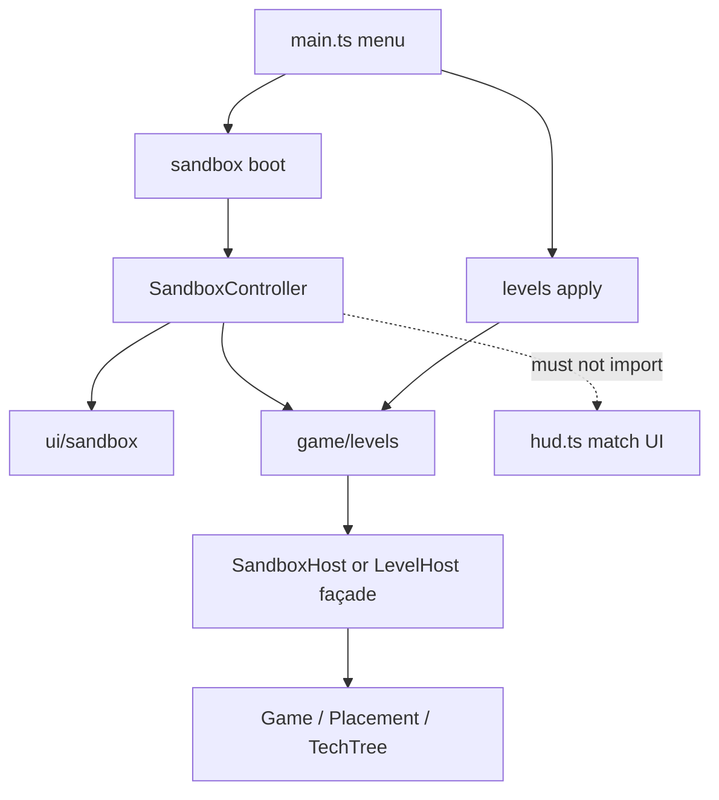

# Sandbox & Level Editor — Design Document (Review Draft)

Plan for a **Single Player Sandbox / Level Editor** that authors board setups
and exports them as playable **challenge levels**. The same `LevelDef` format
is the intended atom for a future **Campaign**.

**Status:** design only — not implemented. Written for review after a code
survey of Melodan’s match boot, placement, tech, economy, HP, and save/replay
paths (2026-09-13).

**Read first:** [ARCHITECTURE.md](ARCHITECTURE.md) (action log, determinism),
[TEAM_MODES_PLAN.md](TEAM_MODES_PLAN.md) (seats), [PROGRESSION_PLAN.md](PROGRESSION_PLAN.md)
(loadouts = choice, not unlock). This document must not violate those
contracts without an explicit exception section.

---

## 0. Locked design decisions

Settled in the planning session. Do not re-open without a written reason.

1. **Build author mode and playable export together.**  
   Campaign will need the same format soon; a cheat-only sandbox would be
   throwaway work.

2. **Play mode = fresh build phase against an authored scene.**  
   Not “instant battle from a frozen player army.” The player receives
   challenge money / slots / unlocks / tech filters and builds (and may keep
   pre-placed player units — see §6.4).

3. **Board editing = `MapSize` + presets only.**  
   No cell-by-cell zone painting, no height sculpting, no on-grid blocker
   painting. Authors set how large zones are (e.g. tiny duel pad vs standard).

4. **Per-side match HP is authored and may be asymmetric.**  
   `{ player: 1, enemy: 1 }` ≈ short decisive match; `{ player: 1, enemy: 1000 }`
   ≈ multi-round siege via existing withdraw chip damage. Not a separate
   “lives per lost round” system.

5. **Win condition for v1 = normal match end** (side HP ≤ 0 / stronghold
   paths as today). Special goals (kill tagged unit, survive N rounds) are
   **schema-reserved only**.

6. **Play mode freezes enemy seat buys.**  
   The challenge is the authored enemy/horde setup; the AI must not rebuild
   or shop on the enemy side during play.

7. **Scene snapshot, not action-log replay, is the level format.**  
   Editor god-mode mutations do not map cleanly onto a fair challenge log.
   Closest precedents: tutorial free-spawn (`tutorialRuntime.ts`), SP cheats
   (`game.ts`).

8. **Sandbox author tools are SP-only** and never part of multiplayer wire
   protocol.

9. **Strict code separation — editor must not bloat core game code.**  
   Author/editor complexity lives in dedicated modules (`src/game/levels/` for
   the shared LevelDef pipeline, `src/game/sandbox/` + `src/ui/sandbox/` for
   author tools). Core files (`game.ts`, `actions.ts`, `placement.ts`, `hud.ts`,
   …) may gain only **thin hooks / host interfaces / tiny play-mode gates**
   (same spirit as `TutorialHost` + `tutorialRuntime.ts`). No large editor
   branches inside the normal match loop. See §17.

---

## 1. Goals and non-goals

### 1.1 Goals

| Goal | Why |
|------|-----|
| Freely place **player, enemy, and horde** units/buildings/towers/Black Brood | Balance tests (“1 archer vs 1 ogre”), set-piece Campaign boards |
| Infinite (or huge) money, HP, build time in **author** mode | Remove friction while staging |
| Every unit pack exposes **all** techs in its allowlist; toggle **on and off** | Normal matches only buy selected loadout techs; sandbox needs full control |
| Free **upgrade and downgrade** (packs, towers, etc.) | Fast iteration; left/right mouse (or equivalent) |
| Change **board size** via presets + numeric zone knobs | Tiny boards for unit duels; larger boards for Campaign set pieces |
| Export a **LevelDef** and play it as a challenge | Campaign pipeline; shareable playtests |
| Challenge knobs: season, money, deploy slots, unlock filter, tech availability, side HP | Authored difficulty without code changes |
| Prepare for future **objectives** without implementing them | Avoid format break when Campaign needs “kill the boss” |

### 1.2 Non-goals (this pass)

- Full Campaign map UI, chapter select, progression rewards
- Implementing special win objectives (stub schema only)
- Cell-painted deploy zones / asymmetric masks
- On-grid pathing blockers / scenery editor
- Heightmap / irregular board shapes
- Multiplayer shared editor / Workshop upload
- Replacing Shift+U and other SP cheats (they can remain; Sandbox is the intentional tool)
- Auto balance lab (N seeded runs → winrate) — nice later
- Alternate scoring where each lost *round* costs exactly 1 life

### 1.3 Success criteria (review / later QA)

- Author can stage a 1v1 unit matchup on a tiny board, toggle techs, run Test
  Battle, reset, export JSON, and reload it as a playable challenge.
- Play challenge: player gets a build phase with authored money/slots/unlocks;
  enemy composition matches export; enemy does not AI-shop.
- Asymmetric HP behaves as expected under existing `applyBattleResult` chip
  rules.
- `LevelDef` validates; corrupt/old versions fail closed with a clear message.
- No MP desync surface: sandbox actions never appear on the wire.

---

## 2. Product surfaces

### 2.1 Menu entry points

Under **Single Player** (see `main.ts` menu views):

1. **Sandbox** — opens author mode (empty or last-edited draft).
2. **Custom Levels** — list of saved `LevelDef`s + Import (clipboard / file) →
   **Play**.

Future Campaign will load registry ids / bundled JSON rather than the
player’s local library, but the **apply path is identical**.

### 2.2 Two runtime modes

```text
┌─────────────────────┐         export          ┌─────────────────────┐
│  AUTHOR (Sandbox)   │ ──────────────────────► │  LevelDef (JSON)    │
│  god place/tech/HP  │                         │  scene + challenge   │
│  Test Battle/Reset  │ ◄── reload draft ───────│  map + flags        │
└─────────────────────┘                         └──────────┬──────────┘
                                                           │ play
                                                           ▼
                                                ┌─────────────────────┐
                                                │  PLAY (Challenge)   │
                                                │  fresh build phase  │
                                                │  frozen enemy buys  │
                                                │  normal win (HP)    │
                                                └─────────────────────┘
```

Wiring proposal (names flexible at implement time):

- `GameSettings.sandbox = { author: true }` — author mode.
- `GameSettings.level = LevelDef` — play mode (and Campaign later).
- Mutually exclusive in practice: author may hold an in-memory draft that
  becomes `level` when playing a Test Battle from editor.

### 2.3 Relationship to existing SP modes

| Mode | Role after Sandbox ships |
|------|---------------------------|
| Practice | Unchanged casual 1v1/2v2/Horde |
| Campaign (climb) | Later consumes `LevelDef`s; today’s climb can stay until migrated |
| Tutorial | Stays scripted; may eventually be LevelDefs + tutorial overlay |
| Cheats (Shift+U, …) | Dev shortcuts; Sandbox is the supported authoring path |

---

## 3. Current engine facts (constraints)

These are **as-built** facts that shape the design.

### 3.1 Modes are settings + seats, not separate engines

- Match shape: `GameSettings` (`src/game/settings.ts`) + optional `seats`
  (`src/game/seats.ts`).
- SP local matches use `localMatchSettings()` in `main.ts` (very long build /
  specialist / card timers).
- Campaign adds `settings.climb`; tutorial adds `settings.tutorial`.

### 3.2 Mutations go through `ActionDispatcher`

- Buy/place/tech/level: `src/game/actions.ts`.
- Placement: `src/game/placement.ts` — zone checks, slots, occupancy.
- Bypasses already used by tutorial/horde/cheats:
  - `placement.spawn(..., free=true)` — skip economy
  - `placement.spawnAtWorld(...)` — gridless (horde ring, produce, etc.)

### 3.3 Tech is loadout-gated, buy-only, no revoke

- Catalog / allowlist: `src/game/techCatalog.ts` (`UNIT_TECH_ALLOWLIST`,
  `UNIT_TECH_SLOTS`).
- In-match: `TechTree` (`src/game/tech.ts`); `buyTech` requires selection via
  `isTechSelectedForUnit`, pays cost, no first-class “remove tech”.
- Innate techs always on.

**Sandbox implication:** author mode must (a) treat loadout as full allowlist,
(b) add grant/revoke, (c) ignore cost/slot caps while authoring.

### 3.4 Levels go up via actions; down only via undo (today)

- Pack level: `buyLevel` / `buyLevelBatch` (XP + supply).
- Towers: `upgradeTower`.
- Downgrade today: undo only; cheats can mutate `unit.level` off-log.

**Sandbox implication:** explicit `sandboxSetLevel` (or equivalent) that can
raise and lower without XP/supply.

### 3.5 Economy, timers, HP

- Economy per **seat** (`Economy` in `settings.ts`): round grant from
  `startingSupply` + growth, × `moneyFactor`.
- Match HP per **side** (`playerHp` / `enemyHp` in `game.ts`): normally
  granted from commander cards’ `startingHp`; climb/tutorial force fixed
  `sideHp` after pick.
- Battle result HP chip: `applyBattleResult` → survivors deal `hpWithdrawOf`
  (`units.ts`) to the opposing side (`hpDraw.ts` / `buildHpDrawSources`).
  Horde scoring rules already documented on `applyBattleResult`.

### 3.6 Map is parametric `MapSize`

```ts
interface MapSize {
  zoneCols: number;   // each side’s main territory width
  zoneRows: number;   // each side’s main territory depth
  neutralRows: number;
  flankCols: number;
  rimCells: number;
}
```

- `STANDARD_MAP` ≈ 60×30 zones, 4 neutral, 6 flank, 4 rim (`map.ts`).
- Full grid: `cols = zoneCols + 2*flankCols + 2*rimCells`,
  `rows = 2*zoneRows + neutralRows + 2*rimCells`.
- Deploy ownership: `isPlayerCell` / `isEnemyCell` from formulas +
  `flanksUnlocked` / `neutralUnlocked` flags.
- Relief height: seeded noise (sim-visible); **not** editable per cell.
- Scenery/forest scales to board size.

**Author “5×10 board”** means setting `zoneCols`/`zoneRows` (and possibly
shrinking flanks/rim/neutral), **not** painting 50 cells.

### 3.7 Black Brood / off-map

| Id | Role |
|----|------|
| `hordeZombie` | Black Brood swarm pack; horde fodder; not player-buyable |
| `hordeBrutSpawn` | Single spider; produce / Cursed Christine gift |
| `hordeSpinne` | Mother; innate produce |

Horde waves use forest-ring `spawnAtWorld` (`team: 'horde'`, seat `-1`).
Author mode must place brood on-grid and/or in the ring.

### 3.8 Save / replay today

- SP resume: `sessionStorage` action log (`net.ts` `SinglePlayerSave`).
- Replay: `Game.exportReplay()` → seed + settings + `LoggedAction[]`.
- **No** board-snapshot level format yet.

Cheats that mutate off-log diverge from resume/replay — Sandbox author
sessions should either (a) not promise resume fidelity, or (b) use
logged sandbox actions / periodic draft serialization to `LevelDef`.

**Recommendation:** Author mode autosaves a `LevelDef` draft to
`localStorage`; do not rely on the SP action-log resume for editor
fidelity. Test Battle / Play hydrate from `LevelDef`.

---

## 4. Core data model: `LevelDef`

New module group: `src/game/levels/`  
(`levelDef.ts` schema + validate/normalize, `applyLevel.ts` boot apply,
`levelLibrary.ts` localStorage I/O, `mapPresets.ts` named sizes).

### 4.1 Conceptual schema (version 1)

```ts
/** Discriminated union reserved for Campaign; ignored in v1 play. */
type LevelObjective =
  | { kind: 'destroySide' } // default implicit behavior — may omit
  | { kind: 'surviveRounds'; rounds: number }
  | { kind: 'killTagged'; tag: string }
  | { kind: 'protectTagged'; tag: string };

interface LevelUnit {
  typeId: string;
  team: 'player' | 'enemy' | 'horde';
  seat?: number;           // default primary seat for team; horde → -1
  /** Grid anchor (top-left style consistent with placement); omit if gridless */
  col?: number;
  row?: number;
  /** World placement for ring/brood gridless spawns */
  x?: number;
  z?: number;
  rotated?: boolean;
  level: number;           // pack level or tower level as appropriate
  xp?: number;
  techs: string[];         // researched / toggled on at apply (non-innate)
  tags?: string[];         // for future objectives
  gridless?: boolean;
}

interface LevelDef {
  version: 1;
  id: string;              // stable uuid
  name: string;
  createdAt?: string;      // ISO
  updatedAt?: string;
  seed?: number;           // AI/random; optional

  /** Drives GameSettings.map / BattleMap construction */
  map: MapSize;
  mapFlags?: {
    flanksUnlockedAtStart?: boolean;
    neutralUnlockedAtStart?: boolean;
  };

  /**
   * Sparse overrides merged onto localMatchSettings()/DEFAULT_SETTINGS.
   * Prefer challenge.* for player-facing knobs; use this for hordePreset,
   * strongholdMode, battleTimeSeconds, etc.
   */
  settingsPatch?: Partial<GameSettings>;

  challenge: {
    season: 'spring' | 'summer' | 'autumn' | 'winter';
    startingSupply: number;
    /** Deploy slot baseline (DeploySettings.unitsPerRound) */
    unitsPerRound: number;
    extrasBudgetPerRound?: number;
    /** Fixed match HP — commander startingHp ignored (climb/tutorial pattern) */
    sideHp: { player: number; enemy: number };
    /**
     * Shop unlock filter for the human seat.
     * Empty array = “no unlocks” (must be explicit).
     * Omit field = use normal round-1 unlock behavior (document exact default
     * in normalizeLevelDef).
     */
    unlockedUnitIds?: string[];
    /**
     * Per typeId: which techs may be researched in play.
     * Omit type = full UNIT_TECH_ALLOWLIST for that type.
     * Empty array for a type = no researchable techs.
     */
    techAllowlist?: Record<string, string[]>;
    /**
     * fullAllowlist: seat loadout = allowlist (or challenge override).
     * fixed: loadout exactly challenge.techAllowlist / authored picks;
     *        player cannot expand mid-match via cards if we also gate unlocks.
     */
    loadoutMode: 'fullAllowlist' | 'fixed';
    /** If true, wipe team:player mobile army from scene before build (Campaign). Default false. */
    clearPlayerArmy?: boolean;
    /** Optional forced commander / skip card pick (tutorial-like). */
    forceCommanderId?: string;
    skipCardPick?: boolean;
  };

  scene: {
    units: LevelUnit[];
    // reserved: items, spells, rally points, oil baseline, …
  };

  /** v1: present but not evaluated */
  objectives?: LevelObjective[];
}
```

### 4.2 Why snapshot beats action log for levels

| Approach | Pros | Cons |
|----------|------|------|
| Action log replay | Matches MP determinism story | Editor god actions ≠ fair play; hard to “fresh build for player only” |
| **Scene snapshot** | Exact enemy board; clean challenge apply; Campaign-friendly | Must version schema; remount map carefully |

Play boot algorithm (high level):

1. Build `GameSettings` from `localMatchSettings` + `def.map` + `settingsPatch`
   + level/play flags (enemy buy freeze, fixed HP path).
2. `constructGame` / `new Game(...)` as today.
3. After bases exist: optionally clear default armies if any; `applyLevelScene`.
4. Apply challenge: season snap, supply, deploy, unlocks, loadouts, `sideHp`.
5. Start build phase for human; enemy AI buy path no-ops.

### 4.3 Normalization & validation

`normalizeLevelDef(raw): LevelDef | { error: string }`:

- Reject unknown `version` (forward-compatible: accept v1 only for now).
- Clamp `MapSize` to sane mins/maxes (prevent 0-size or GPU-melting boards).
- Drop unknown `typeId`s with warning, or fail hard — **recommend fail hard
  on play**, warn-and-strip in author import.
- Tech ids not in allowlist stripped.
- Units with missing grid coords and not `gridless` rejected.
- `sideHp.player/enemy` must be ≥ 1 (or ≥ 0 if we allow already-dead debug —
  recommend ≥ 1).

### 4.4 Storage

| Store | Key / form | Contents |
|-------|------------|----------|
| Local library | `localStorage` e.g. `mechili-levels` | Array of `LevelDef` |
| Editor draft | `localStorage` e.g. `mechili-level-draft` | In-progress author `LevelDef` |
| Clipboard | JSON text | Share / review |
| File download | `*.melodan.json` or `*.level.json` | Backup |
| Bundled Campaign (later) | repo / build assets | Read-only registry |

Do **not** put LevelDefs in the MP replay stream.

---

## 5. Board layout (author + level)

### 5.1 Presets (proposed starting set)

Exact integers are **tunable at implement time**; document intent:

| Preset id | Intent | Rough zone feel |
|-----------|--------|-----------------|
| `tiny` | 1–2 packs per side duel | Very small `zoneCols`×`zoneRows` (order of ~8–16 × ~6–10) |
| `compact` | Small skirmish | Between tiny and standard |
| `standard` | Current live feel | `STANDARD_MAP` (60×30, …) |
| `wide` | More flank play | Larger `zoneCols` / `flankCols` |
| `deep` | Longer approach | Larger `zoneRows` |

UI shows: preset buttons + advanced disclosure for the five numeric fields +
live readout of **derived full grid** (`cols×rows` and world size).

### 5.2 Remount policy

Changing `MapSize` in author mode:

1. Serialize current scene to `LevelUnit[]` (world or cell).
2. Tear down / rebuild `BattleMap`, overlay, hazard field sizing, scenery
   bound to map (implementation detail in `game.ts` — may be “soft restart
   Game with same draft” if hot remount is too invasive).
3. Re-apply units still in-bounds; list dropped OOB units in a toast.

**Prefer “restart match with draft”** if hot remount risks dangling GPU
resources — document choice in implementation PR.

### 5.3 Map flags

- `flanksUnlockedAtStart` → set `map.flanksUnlocked = true` before first
  build (normally round 2+).
- `neutralUnlockedAtStart` → same for neutral strip split.

---

## 6. Challenge rules (play)

### 6.1 Side HP (match length)

- On play boot, set `playerHp` / `enemyHp` (and peaks used by HUD) from
  `challenge.sideHp`, using the same fixed-HP path as tutorial/climb
  (`climbSideHp` / `restoreSideHp` patterns in `game.ts` / `actions.ts`).
- Commander card `startingHp` must **not** stack on top.
- Round chip remains `applyBattleResult` + `hpWithdrawOf`.

**Author education in UI (one line):**  
“HP is chipped by surviving units’ withdraw values each battle — 1 HP is
usually one fight; large HP means multiple rounds.”

Quick presets:

| Preset | player | enemy |
|--------|--------|-------|
| Sudden | 1 | 1 |
| Standard | ~commander-scale or mid (tune) | same |
| Siege | 1 (or low) | 1000+ |

### 6.2 Economy & deploy

- `startingSupply` → set liquid supply for human seat at challenge start
  (and define whether round grant still runs on later rounds — **commit:
  yes**, growth from `economy` / patch unless `settingsPatch` zeros growth).
- `unitsPerRound` → `deploy.unitsPerRound`.
- `extrasBudgetPerRound` optional override.

### 6.3 Unlocks & techs

- `unlockedUnitIds`: replaces human `unlockedUnits[seat]` at start.
- `techAllowlist` + `loadoutMode`: builds seat `loadout` so `buyTech` only
  sees allowed ids; costs remain unless we add a challenge flag
  `freeTech: true` (optional later).
- Authored enemy units’ `techs[]` applied into enemy `TechTree` (and/or
  per-unit ownership if the engine is seat-wide — **today techs are seat-wide
  per type**). Document: enemy techs in scene are granted to that seat’s
  tree for those type ids so all packs of that type benefit — consistent
  with live game. If per-pack tech is ever needed, that is a larger engine
  change (out of scope).

### 6.4 Player units in the scene

**Default (`clearPlayerArmy: false`):** authored `team: 'player'` units remain
as starting board (fortifications / pre-placed army); player still spends
challenge money/slots to add more.

**Campaign flag (`clearPlayerArmy: true`):** strip player mobile army (define
whether structures/towers stay — **recommend:** keep structures/towers,
clear non-structure packs unless tagged `keep`).

### 6.5 Enemy / horde in play

- Spawn from scene as free placements.
- **No AI buys, unlocks, or tech purchases** on enemy seats while
  `settings.level` is set (guard in `AiOpponent` / dispatcher).
- Horde: if scene includes horde units, ensure `hordePreset` enables horde
  camera/systems as needed; optional `settingsPatch.hordePreset`.
- Between rounds: **commit default** — enemy army that died stays dead
  unless we add `enemyRebuild: true` later. Player gets normal rebuild/
  income. (Authored static defense / wave-once feel.) Alternative
  “restore enemy scene each round” is a future challenge flag.

### 6.6 Season

Snap weather/scenery to `challenge.season` at boot (`Scenery.setSeason` /
Weather APIs). Author mode can change season live and persist into draft.

### 6.7 Objectives (stub only)

- Parser accepts `objectives` array.
- Evaluator always falls through to normal HP win until implemented.
- Scene `tags` on units support future `killTagged` / `protectTagged`.

---

## 7. Author mode — detailed behavior

### 7.1 Boot

- `sandbox.author = true`, classic 1v1 seats, AI disabled or no-op.
- Huge supply both seats; huge / ignored side HP for editing comfort (or
  show challenge HP panel as “export values” without applying pressure).
- Long timers (`localMatchSettings`).
- Load draft from `mechili-level-draft` if present.
- Full shop catalog including non-buyable horde types in a Sandbox palette.
- Loadout = full allowlist for all types (author).

### 7.2 Team brush

Toolbar: **Player | Enemy | Horde**.  
Next place/spawn uses that team (and default seat). Bypass:

- Territory zone checks (or allow place anywhere on playable grid + rim ring)
- Deploy slots / extras budget
- Unlock list
- Supply charges (`free` spawn)

**Delete:** select + Delete/Backspace, or eraser tool.

### 7.3 Tech panel

With a pack selected:

- List `UNIT_TECH_ALLOWLIST[typeId]` (and show innates as locked-on).
- Click toggles membership in that seat’s researched set for the type
  (engine today is seat-wide — UI should say “techs apply to all packs of
  this type on this side”).
- Persist into draft scene: when exporting, write `techs` onto each unit of
  that type on that team **or** store a side-level tech map in scene
  (`scene.techsByTeam?: Record<Team, Record<typeId, string[]>>`) to avoid
  duplication — **recommend side-level tech map in v1.1**; for v1, duplicate
  onto units at export for simplicity.

### 7.4 Level up / down

- **Left click** (or `[` / scroll) on selected: level + 1 (clamp to max).
- **Right click** (or `]`): level − 1 (clamp to 1 or 0 per type rules).
- Towers use tower max (5). No XP/supply.
- Update draft continuously.

### 7.5 Board & challenge panel

Side panel sections:

1. Map preset + advanced size + flank/neutral flags  
2. Challenge export settings (season, money, slots, HP, unlocks, techs)  
3. Library: Save / Save As / Export clipboard / Import  

Changing challenge fields updates the draft only; they apply on Play / Test.

### 7.6 Test Battle

1. Freeze draft snapshot `S`.
2. Enter play-like rules **or** start battle phase in-place with current
   armies (for pure unit tests, in-place battle is faster).
3. **Commit:** Test Battle = apply draft as temporary play settings but keep
   editor chrome; on end or “Return to Editor”, restore scene from `S`
   (full re-apply).

Outcome strip (lightweight): time elapsed, surviving withdraw sums or HP
remaining both sides — helps “archer vs ogre” iteration.

### 7.7 Author mutations — keep out of `ActionDispatcher`

**Do not** grow the multiplayer `Action` / `LoggedAction` union with a large
set of `sandboxPlace` / `sandboxSetTech` / … kinds. That would couple editor
complexity into the deterministic action log every mode shares.

**Commit:**

- Author edits are owned by `SandboxController` (see §17): call existing
  placement/tech/economy **host APIs** (`spawn(..., free)`, direct level
  set, tech grant/revoke helpers exposed on a narrow host), then update the
  in-memory `LevelDef` draft.
- Undo/redo (if wanted) is an **editor-local** stack of draft snapshots or
  editor commands — not `ActionDispatcher` undo.
- Play-mode challenge matches still use the normal action log for the
  **player’s** legal buys/moves only.
- Shift+U-style cheats stay as-is; Sandbox does not need to mimic them inside
  `actions.ts`.

---

## 8. Play mode — detailed behavior

1. Menu → Custom Levels → select def → Play.  
2. Skip or auto commander per `challenge.skipCardPick` /
   `forceCommanderId`.  
3. Apply map, scene, challenge (§4.2 / §6).  
4. Human build phase; shop filtered; techs filtered.  
5. Lock-in → battle → HP draw → next round until side HP ≤ 0 (or stronghold
   loss rules).  
6. Enemy never shops; enemy dead packs do not return (default).  
7. Victory / defeat UI → back to level list.

SP resume: optional. If enabled, resume must store `LevelDef` id + action log
+ phase; first implement **without** resume to reduce scope.

---

## 9. UI / UX outline

### 9.1 Author chrome

- Top or left toolbar: team brush, erase, select, duplicate, mirror side,
  clear side, Test Battle, Save, Play Challenge.
- Right inspector: selection (type, level, techs), challenge settings,
  map settings.
- Keep HUD familiar but replace economy with “Sandbox” badge + optional ∞.

### 9.2 Play chrome

- Normal HUD; show level name; optional “Challenge” badge.
- Hide enemy shop fog concerns if enemy cannot act — fog rules can match
  Campaign (live-visible) for clarity while testing.

### 9.3 Accessibility / input

- Mouse L/R for level; keyboard alternatives required.
- Touch: long-press menu for level/tech if the game supports touch SP.

---

## 10. Campaign readiness

`LevelDef` is the campaign level atom.

Future shapes (not building now):

```ts
// illustrative only
interface CampaignChapter {
  id: string;
  levels: string[]; // LevelDef ids in registry
}
```

Climb migration: replace or wrap today’s `ClimbSettings` with a list of
level ids; between-level UI already has “Round n/total” patterns in HUD.

Objectives evaluator later plugs into match-end / mid-battle checks without
changing scene format if `tags` exist.

---

## 11. Extra ideas (prioritized)

### 11.1 Include if cheap during MVP

- Mirror / clear side  
- Duplicate selection  
- Clipboard JSON share  
- Validation warnings (empty enemy, zero unlocks, OOB after resize)  
- Outcome strip after Test Battle  
- Map preset `tiny` for unit labs  

### 11.2 Later

- `enemyRebuild` / `restoreSceneEachRound`  
- True objective kinds + UI  
- Dialogue / scripting hooks  
- Steam Workshop  
- Offline balance harness (N seeds → winrate)  
- Per-pack tech (engine change)  
- Author multi-seat 2v2 scenes  

---

## 12. Files likely to change (implementation map)

### 12.1 New modules (bulk of the work)

| Module | Responsibility |
|--------|----------------|
| `src/game/levels/` | `LevelDef` schema, normalize/validate, `applyLevelScene` / `applyChallenge`, map presets, local library I/O — **shared by Play + future Campaign; no editor UI** |
| `src/game/sandbox/` | Author session: `SandboxController`, draft autosave, team brush tools, Test Battle/Reset orchestration, editor undo stack |
| `src/ui/sandbox/` | Author toolbar, map/challenge inspectors, tech toggle panel, level library UI — **not** folded into `hud.ts` |

### 12.2 Core touchpoints (keep tiny)

| File | Allowed change |
|------|----------------|
| `src/game/settings.ts` | Optional `sandbox?` / `level?` fields + normalize |
| `src/game/game.ts` | Construct/dispose sandbox or level applicator via host interface; **no** editor tool logic inline |
| `src/game/ai.ts` | One gate: skip buys when playing a level / enemy frozen |
| `src/game/actions.ts` | Prefer **no** new sandbox action kinds; at most tiny shared helpers if play needs a gate |
| `src/game/placement.ts` | Prefer **no** editor branches; reuse `spawn` / `spawnAtWorld`; if a `free`/`ignoreZone` flag is missing, add a **generic** parameter — not `if (sandbox)` |
| `src/game/tech.ts` | Small revoke/grant helper usable by sandbox host — not UI |
| `src/main.ts` + menu HTML | Menu entries that call into levels/sandbox modules |
| `src/ui/hud.ts` | At most “is sandbox chrome active?” hooks / hide a row — not panels |

**Precedent:** `tutorialRuntime.ts` + `TutorialHost` — logic outside `Game`, host is a façade.

### 12.3 Hard rule for PRs

If a PR adds more than ~a screenful of sandbox/editor branching to `game.ts`,
`actions.ts`, or `hud.ts`, it should be rejected in review and moved under
`sandbox/` / `ui/sandbox/` / `levels/`.

---

## 13. Suggested delivery phases

1. **Schema + apply + play-from-JSON** (even with hand-written JSON)  
2. **Author place/remove + team brush + draft autosave**  
3. **Tech toggle + level L/R**  
4. **Map presets + remount/restart + side HP + challenge panel**  
5. **Test Battle / Reset + library UI + menu entries**  
6. **Hardening:** enemy buy freeze, validation, outcome strip, objectives stub  

Each phase should be independently reviewable / playable.

---

## 14. Risks and open implementation choices

| Risk / choice | Notes | Recommendation |
|---------------|-------|----------------|
| Editor bloat in `game.ts` / `actions.ts` | Feature will get complex | §17 separation; host façade; reject fat PRs |
| Hot map remount complexity | Scenery, hazards, overlays, bases | Soft-restart Game with draft (orchestrated from `sandbox/`) |
| Seat-wide techs vs per-unit scene techs | Engine is seat-wide today | Author UI honesty; duplicate onto units at export |
| Enemy persistence across rounds | Dead enemy vs restore | Default: stay dead |
| Resume during play challenges | Extra save shape | Defer |
| Tiny maps vs `BASE_ANCHORS` | Bases may not fit | Clamp minimum map so anchors fit, or scale anchors for tiny (prefer clamp mins) |
| Horde without horde preset | Camera/systems | Auto-enable light horde preset when scene has horde team |
| Determinism / telemetry | Levels are SP | Mark matches as `level`/`sandbox` in telemetry |

---

## 15. Review checklist (for readers of this doc)

- [ ] Agree snapshot `LevelDef` (not action-log) as Campaign atom  
- [ ] Agree MapSize-only board editing + named presets  
- [ ] Agree asymmetric `sideHp` + existing withdraw chip (no lives mode)  
- [ ] Agree play = fresh build; enemy buys frozen; default keep authored player units  
- [ ] Agree enemy army does not rebuild each round (v1)  
- [ ] Agree objectives stub-only  
- [ ] Confirm minimum map size policy vs stronghold anchors  
- [ ] Confirm Test Battle = restore-from-snapshot editor loop  
- [ ] Confirm localStorage library + clipboard as v1 sharing  
- [ ] Agree **strict module separation** (§0.9 / §17): editor in `sandbox/` + `ui/sandbox/`, LevelDef pipeline in `levels/`, core only thin hooks  

---

## 16. Appendix — example LevelDef (illustrative)

```json
{
  "version": 1,
  "id": "example-archer-vs-ogre",
  "name": "Archer vs Ogre (tiny)",
  "map": {
    "zoneCols": 12,
    "zoneRows": 8,
    "neutralRows": 2,
    "flankCols": 2,
    "rimCells": 2
  },
  "mapFlags": {
    "flanksUnlockedAtStart": true,
    "neutralUnlockedAtStart": true
  },
  "challenge": {
    "season": "autumn",
    "startingSupply": 500,
    "unitsPerRound": 4,
    "sideHp": { "player": 1, "enemy": 1 },
    "unlockedUnitIds": ["archer"],
    "loadoutMode": "fullAllowlist",
    "clearPlayerArmy": false,
    "skipCardPick": true
  },
  "scene": {
    "units": [
      {
        "typeId": "archer",
        "team": "player",
        "col": 4,
        "row": 3,
        "level": 1,
        "techs": []
      },
      {
        "typeId": "ogre",
        "team": "enemy",
        "col": 4,
        "row": 12,
        "level": 1,
        "techs": []
      }
    ]
  },
  "objectives": []
}
```

*(Type ids in the example are placeholders — use real catalog ids at
authoring time.)*

---

## 17. Code architecture & separation

Editor/authoring will get large. **Normal match code must stay readable.**
Follow the tutorial pattern: fat logic outside, thin host façade on `Game`.

### 17.1 Package split

```text
src/game/levels/          # LevelDef — Play + Campaign (no editor chrome)
  levelDef.ts             # types, version, normalize, validate
  mapPresets.ts           # tiny/compact/standard/…
  applyLevel.ts           # apply scene + challenge onto a live Game via host
  levelLibrary.ts         # localStorage / import / export helpers

src/game/sandbox/         # Author-only session logic
  sandboxController.ts    # tools, draft, Test Battle, remount orchestration
  sandboxCommands.ts      # editor undo stack (optional)
  sandboxHost.ts          # SandboxHost interface (what Game must expose)

src/ui/sandbox/           # Author-only DOM/UI
  sandboxToolbar.ts
  sandboxInspector.ts     # map, challenge, tech, selection
  levelLibraryPanel.ts
```

Play mode and Campaign **only depend on `levels/`**, never on `sandbox/` or
`ui/sandbox/`. Author mode depends on both.



### 17.2 Host façade (allowed core surface)

`Game` implements a small interface (names illustrative), analogous to
`TutorialHost`:

```ts
interface LevelPlayHost {
  readonly settings: GameSettings;
  readonly map: BattleMap;
  readonly placement: PlacementController;
  readonly economy: Economy;
  // …only what applyLevel / challenge gates need
  setSideHp(player: number, enemy: number): void;
  setSeason(season: Season, immediate?: boolean): void;
  freezeEnemyBuys(frozen: boolean): void;
}

interface SandboxHost extends LevelPlayHost {
  /** Soft-restart or remount with a new MapSize while preserving draft apply */
  restartWithDraft(def: LevelDef): void;
  grantTech(seat: number, typeId: string, techId: string): void;
  revokeTech(seat: number, typeId: string, techId: string): void;
  setUnitLevel(unitId: number, level: number): void;
  // selection / camera helpers as needed — still thin
}
```

Wire-up in `game.ts` constructor/boot:

```ts
if (settings.sandbox?.author) {
  this.sandbox = new SandboxController(this.asSandboxHost());
} else if (settings.level) {
  applyLevel(this.asLevelPlayHost(), settings.level);
}
```

No tool state machines inside `Game`.

### 17.3 What must not happen

- Large `if (this.settings.sandbox)` blocks in the battle/build tick
- Editor panels pasted into `hud.ts`
- New `Action` variants for every editor tool (see §7.7)
- Play/Campaign importing `src/game/sandbox/**`
- Duplicating placement rules in the editor — call `placement.spawn` /
  shared helpers with **generic** options (`free`, `ignoreDeployZone`) rather
  than `sandbox: true` flags sprinkled through core

### 17.4 Shared vs author-only

| Concern | Lives in |
|---------|----------|
| `LevelDef` schema / validate / apply | `levels/` (shared) |
| Challenge filters (unlocks, tech allowlist, side HP) | `levels/applyLevel.ts` |
| Enemy buy freeze | one-liner in `ai.ts` reading `settings.level` (or a boolean set by apply) |
| Team brush, L/R level, tech toggle UI, draft autosave, Test Battle | `sandbox/` + `ui/sandbox/` |
| Map remount / soft restart | orchestrated by `SandboxController`, executed via host |

### 17.5 Complexity budget

Expect sandbox UI + tools to grow. That growth is **fine** inside
`sandbox/` and `ui/sandbox/`. It is **not** fine if `game.ts` / `actions.ts`
absorb it. Reviewers should treat core file churn as a red flag unless it is
a reusable primitive (e.g. `spawn` ignoring zones for any caller).

---

## Document history

| Date | Change |
|------|--------|
| 2026-09-13 | Initial review draft from planning session (sandbox + level export, MapSize boards, asymmetric side HP, Campaign-ready schema) |
| 2026-09-13 | Locked strict code separation: `levels/` + `sandbox/` + `ui/sandbox/`; thin host façade; no ActionDispatcher editor bloat (§0.9, §7.7, §12, §17) |
